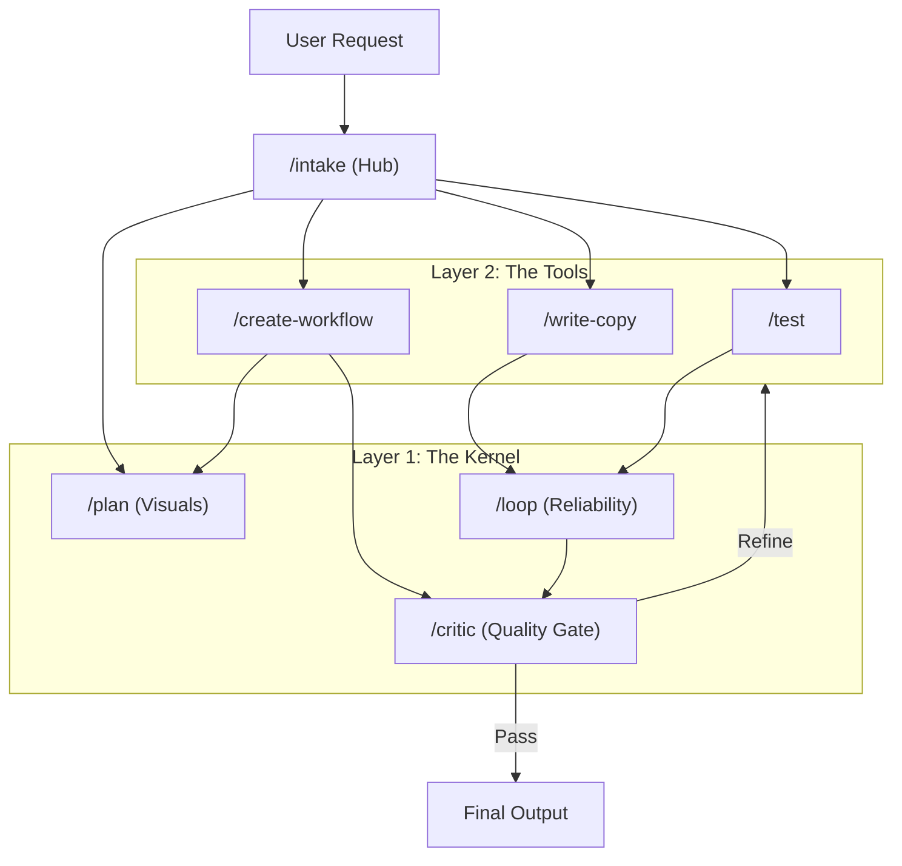

# Universal Antigravity Workflows

This repository contains a collection of reusable workflows and prompt templates designed for Antigravity agents. These workflows are intended to be dropped into any project to provide instant, powerful agentic capabilities.

## The Hub & Tools Architecture

We have moved to a **Hub & Tools** model for better organization.

### 1. The Hub (Entry Point)
-   **[`/intake`](intake.md)**: The Master Router. Always start here. It parses natural language and routes to the correct tool.

### 2. The Tools (Capabilities)
Located in [`tools/`](tools/), these are the functional agents:

- **[Auto-Update](tools/auto-update.md)**: Automates deep-dive analysis and documentation updates for directories.
    - Uses `tools/auto-update/` sub-workflows.
- **[Create Meta-Prompt](tools/create-meta-prompt.md)**: A meta-workflow for generating high-quality structured prompts for other agents.
    - Uses `tools/create-meta-prompt/` sub-workflows.
- **[Create Workflow](tools/create-workflow.md)**: A helper workflow to standardize the creation of new workflow files.
    - Uses `tools/create-workflow/` sub-workflows.
- **[Get Feedback](tools/get-feedback.md)**: Request AI feedback (Vision/Text) on any file.
- **[Run Prompt](tools/run-prompt.md)**: A utility to execute prompts with proper context and handling.
    - Support for `single` and `chain` execution modes.
- **[Smart Commit](tools/smart-commit.md)**: Intelligently analyze changes, auto-update docs, and generate semantic commits.
- **[Test](tools/test.md)**: Intelligent testing agent (Logic, Quality, Workflow) with auto-scaffolding.
    - Uses `tools/test/` sub-workflows.

### 3. The Kernel (OS Core)
Located in [`kernel/`](kernel/), these workflows power the system:
-   **[`/plan`](kernel/plan.md)**: The Architect. Generates visual flowcharts (Mermaid).
-   **[`/critic`](kernel/critic.md)**: The Quality Gate. A "Brutally Honest Coach".
-   **[`/loop`](kernel/loop.md)**: The Reliability Engine. Retries tasks until success.

## Usage

To use these workflows in a new project, simply clone this repository into your `.agent/workflows` directory:

```bash
mkdir -p .agent/workflows
git clone https://github.com/chrisjaeleedesign/universal-workflows.git .agent/workflows/universal-workflows
```

Then run the intake:
```bash
# Example from an agent
/intake "Draft a blog post"
```

## Structure

```
.
├── intake.md          # The Hub
├── kernel/            # The OS
│   ├── plan.md
│   ├── critic.md
│   └── loop.md
└── tools/             # The Capabilities
    ├── auto-update.md
    ├── create-meta-prompt.md
    ├── test.md
    └── ...
```

---

## Interaction Diagram


